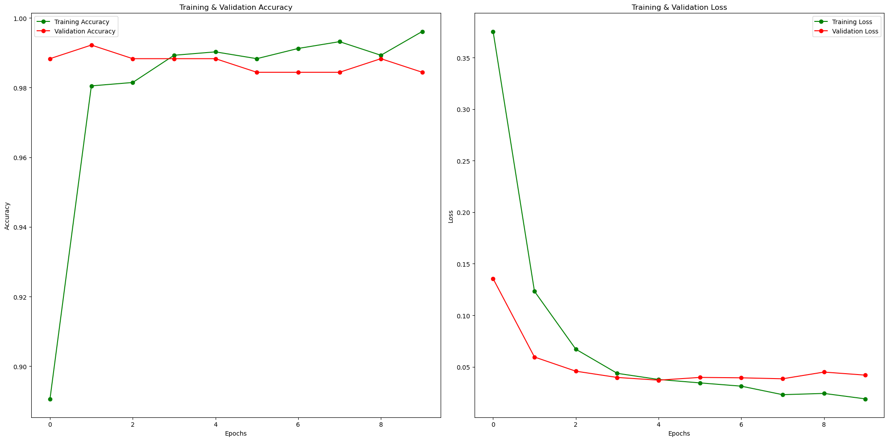

<h1 align='center'>PyTorch Trainer Baseline + TPU Integration </h1>

<p align= "center"><b> I hope you find this repository useful. If you do, please start ⭐ this repository.</b></p>

<p align="center">

</p>

<p align="center">


</p>

## Introduction 

This repository contains the code for an image classification task for [dataset](https://www.kaggle.com/datasets/gatewayadam/cars-and-tanks-image-classification).
The main task is to classify whether the image is of either a Car or a Tank.

I have also made a [training notebook](https://www.kaggle.com/code/nikhilxb/classification-using-multi-model-trainer-on-torch/notebook) trained on GPU-T4x2.
The codes in this repository is for training the model on TPUs.

## Data

The dataset is posted on kaggle by [Gateway Adam](https://www.kaggle.com/gatewayadam).
The data consists of a set of images distinguished as Car & Tanks. 
The data is in the form of .jpg .

## Training

If you want to train the model, you have to perform two steps:

### 1. Get the data
Download the data from [here](https://www.kaggle.com/datasets/gatewayadam/cars-and-tanks-image-classification)

Now, take the downloaded `.zip` file and extract it into the new folder `input/`.

Take care that the `input/` folder is at same directory level as `train.py` file.

### 2. Installing the dependencies

To run the code in this repository, few frameworks need to be installed in your machine. 
Make sure you have enough space and stable internet connection.

Note: torch_xla can have issues while running on Kaggle or Colab Notebooks. Take a look at this kaggle [discussion](https://www.kaggle.com/general/201365).

Run the below command for installing torch_xla dependecies:

```shell
$ pip install cloud-tpu-client==0.10 https://storage.googleapis.com/tpu-pytorch/wheels/torch_xla-1.7-cp37-cp37m-linux_x86_64.whl
```
Run the below command for installing the required dependencies.

```shell
$ pip install -r requirements.txt
```
### 3. Training the model
If you have the above steps right then, running the train.py should not produce any errors. 
To run the code, open the terminal and change the directory level same as `train.py` file. 
Now run the `train.py` file.

```shell
$ python train.py
```
You should start seeing the progress bar, on few seconds at the beginning of training.
If you have any problem, feel free to open a Issue. Will be happy to help.

### 4. Training Result.

If you want to test the mode, find the model weights after training on  `vit_base_patch16_224` run on TPU at this [link](https://drive.google.com/file/d/1OIJQtnbBM8Ii866mibH4AZ6h5wwxE-P2/view?usp=share_link) 

Below shows the metrics plot on GPU. 


#### Note:  
* When training on TPU, we make use of multiple cores and we must merge the scores from different cores.
Run the below code:

```shell
if __name__=="__main__":
  def _map_fn(rank,flags):
    torch.set_default_tensor_type("torch.FloatTensor")
    a= _run()
  FLAGS= {}
  xmp.spawn(_map_fn,args=(FLAGS,),nprocs=8, start_method="fork")
```
In the above code the `_run()` is where the individual results are returned and `_map_fn()` is used to collect them.

* For some useful tips for running PyTorch on TPU, I would recommend you go through this discussion on Kaggle. 👇
https://www.kaggle.com/competitions/jigsaw-multilingual-toxic-comment-classification/discussion/159723


